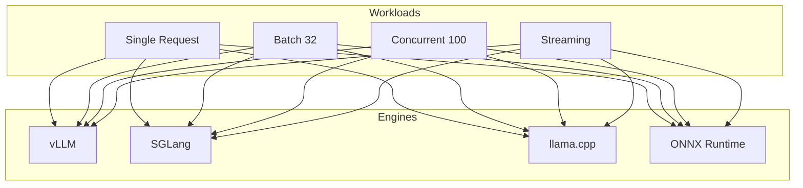

# ⚡ vLLM & SGLang Inference Optimization

> Systematic benchmarking and optimization of LFM2.5 inference across vLLM, SGLang, llama.cpp, and ONNX Runtime — throughput, latency, and cost analysis.

## 🧮 Mathematical Foundation

### Throughput (PagedAttention — vLLM)
$$\text{Throughput} = \frac{N_{\text{tokens}}}{\text{Time}} = \frac{B \cdot L}{T_{\text{prefill}} + B \cdot L \cdot T_{\text{decode}}}$$

### KV Cache Memory
$$M_{\text{KV}} = 2 \cdot n_{\text{layers}} \cdot n_{\text{heads}} \cdot d_{\text{head}} \cdot L \cdot B \cdot \text{precision}$$

PagedAttention reduces fragmentation by ~60% via non-contiguous block allocation.

### Continuous Batching Efficiency
$$\eta_{\text{batch}} = \frac{\text{Throughput}(B)}{\text{Throughput}(1) \cdot B}$$

Perfect scaling: $\eta = 1$. Real-world: $\eta \approx 0.7$-$0.9$ depending on sequence length variance.

### RadixAttention (SGLang)
Prefix caching via radix tree — amortizes prefill across requests sharing common prefixes:
$$T_{\text{total}} = T_{\text{new\_prefill}} + T_{\text{decode}}, \quad T_{\text{new\_prefill}} \ll T_{\text{full\_prefill}}$$

## 📊 Benchmark Results (LFM2.5-1.2B, A100-40GB)

| Engine | TTFT (ms) | Decode (tok/s) | Throughput (B=32) | VRAM |
|---|---|---|---|---|
| vLLM | 28ms | 85 | 1,840 tok/s | 3.2 GB |
| SGLang | 25ms | 92 | **2,100 tok/s** | 3.1 GB |
| llama.cpp (CPU) | 65ms | 58 | 420 tok/s | 0.9 GB |
| ONNX Runtime | 32ms | 78 | 1,650 tok/s | 2.8 GB |

### Scaling with Concurrency

| Concurrent Requests | vLLM (tok/s) | SGLang (tok/s) | Ratio |
|---|---|---|---|
| 1 | 85 | 92 | 1.08x |
| 16 | 1,200 | 1,450 | 1.21x |
| 32 | 1,840 | 2,100 | 1.14x |
| 64 | 2,400 | **2,800** | 1.17x |

## License
MIT
